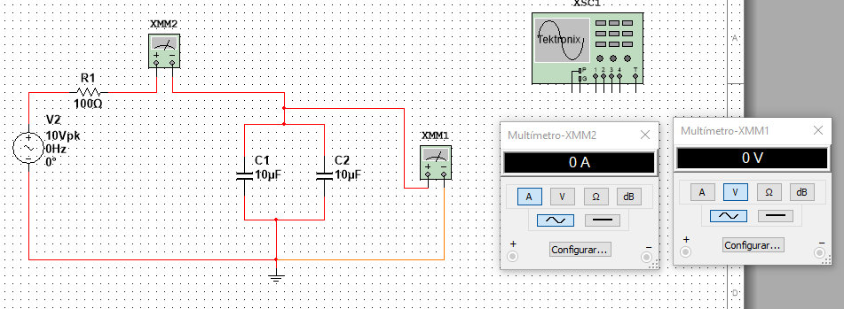
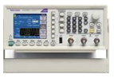
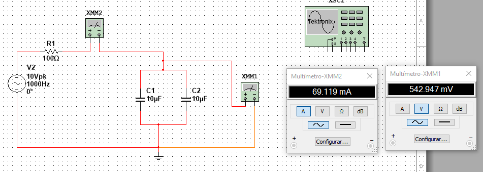
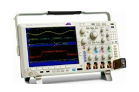
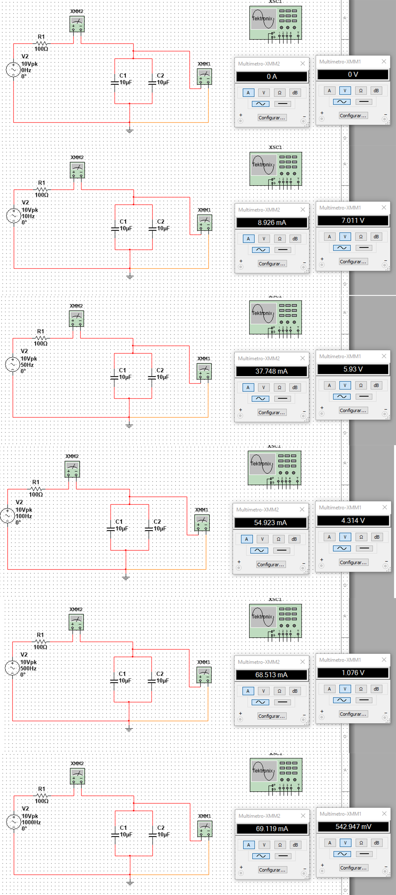
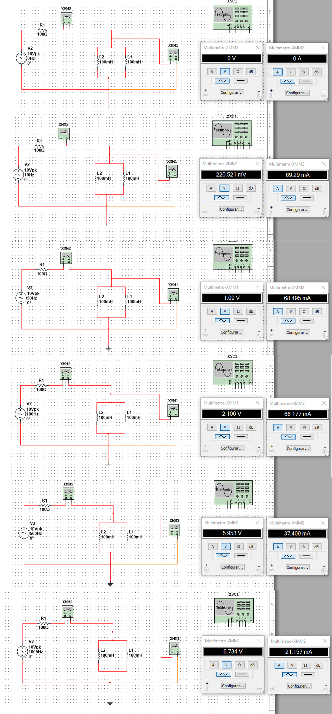
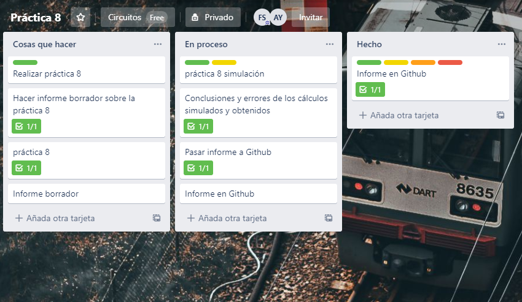

# Informe-8

## OBJETIVOS

Explicar y demostrar experimentalmente la Ley de Kirchhoff de Voltajes y la Ley de Kirchhoff de Corrientes investigación.

**Objetivos específicos:** 
- Verificar el comportamiento de la bobina y el capacitor en circuitos DC.
- Verificar el comportamiento de la bobina y el capacitor en circuitos AC.
- Verificar las combinaciones serie y paralelo de bobinas y capacitores.
- Familiarizarse con el uso de instrumentos de medida. 

## MARCO TEÓRICO

## Capacitores y Bobinas.

Estos 2 elementos son capaces de almacenar una parte de la energía, además de que hay 2 formas de ver estos elementos en un circuito, de forma ideal y de forma real.

**Capacitores (Condensador)**

Es un elemento pasivo de un circuito, que tiene mayor utilidad dentro de un circuito AC ya que si se toma dentro de uno DC se convertirá en un circuito abierto, su medida son los faradios pero se puede transformar en reactancia para agilitar el cálculo con la fórmula: X_c=-1/jwF donde j es muestra de número complejo, w en rad/seg, F en faradios y se mide en ohmios , la característica del capacitor es que este se vuelve dependiente de la frecuencia del generador, entre mas Hz posea esta fuente el capacitor empezara ca comportarse como un cortocircuito, lo contrario a  cuando está en corriente DC. Mientras esta en el dominio del tiempo, su forma de calcular su intensidad es: i=F ∂v/∂t

<section>
      

                   
   

   </section>
   

**Bobinas (Inductor)**

“La suma de las corrientes que entran a un nodo (corriente total de entrada) es igual a la suma de las corrientes que salen de dicho nodo (corriente total de salida).” (Ricárdez, Bastién Montoya, Hernández, & H. S., 2017). Explica que la suma de todas las intensidades en un nodo especifico es igual a 0

Lo curioso entre las bobinas y los capacitores es que son polos opuestos totalmente lo contrario uno del otro, ergo, la bobina en corriente DC solo es un cortocircuito a diferencia que en AC donde con esta característica genera un campo electromagnético y empieza a generar una resistencia la corriente, su medida son los henrios, al igual que los capacitores se puede transformar a reactancia para mejor calculo con la fórmula :X_l=jwL donde j es muestra de numero complejo, w la frecuencia en rads/seg L en henrios, medido en ohmios. Además, si se mantiene en el dominio del tiempo, se puede calcular su voltaje de la siguiente forma: v=L ∂i/∂t

<section>
      

                   
   

   </section>

## **DESCRIPCIÓN DE LOS EQUIPOS Y MATERIALES**

**Generador de onda** 
<section>
      

                   
   

   </section>
   
**Multímetro digital**. Nos ayudara para poder hacer las mediciones de la practica
</section>
      

                   
   

   </section>

**Resistores** de 1kΩ, 2.2kΩ. Los utilizaremos para crear el circuito que vamos a medir
</section>
      

                   
   

   </section>

**Protoboard.** Es la base en la cual se va a formar el circuito con los elementos de este.
</section>
      

                   
   

   </section>

**Osiloscopio.** 
</section>
      

                   
   

   </section>
   
## **PROCEDIMIENTO**

Arme el circuito que se muestra en la figura 1.1.

</section>
      

                   
   

   </section>

Construya en el protoboard el circuito mostrado en la Figura 1.

a. Utilice el osciloscopio para observar el voltaje 𝑉𝑜 variando la frecuencia entre los
valores de 0, 10, 50, 100, 500, 1000 𝐻𝑧. Anote los valores pico de las ondas observadas.

b. Utilice un multímetro para medir el voltaje 𝑉𝑜 variando la frecuencia entre los valores
de 0, 10, 50, 100, 500, 1000 𝐻𝑧. Anote los resultados.

c. Utilice un multímetro para medir la corriente que atraviesa la resistencia variando la
frecuencia entre los valores 0, 10, 50, 100, 500, 1000 𝐻𝑧. Anote los resultados.

***Tabla 1.1. Resultados obtenidos de voltaje y corriente, del circuito 1.***

| ||Multímetro|Multímetro|
|---------|---------|---------|---------|
| **Frecuencia[Hz]**|**Osciloscopio**|**Voltaje**|**Intensidad**|
|**0[Hz]**   |0[V]   |0[V]       |0[A]|
|**10[Hz]**  |9.84[V]|7.012[V]   |8.926[mA]|
|**50[Hz]**  |8.4[V] |5.93[V]    |37.749[mA]|
|**100[Hz]** |6.09[V]|4.314[V]   |54.923[mA]|
|**500[Hz]** |1.55[V]|1.076[V]   |68.513[mA]|
|**1000[Hz]**|781[mV]|542.947[mV]|69.119[mA]|

***Tabla 1.2. Resultados obtenidos de voltaje y corriente, del circuito 2.***

| ||Multímetro|Multímetro|
|---------|---------|---------|---------|
| **Frecuencia[Hz]**|**Osciloscopio**|**Voltaje**|**Intensidad**|
|**0[Hz]**   |0[V]   |0[V]       |0[A]|
|**10[Hz]**  |317[mV]|220.52[mV] |69.29[mA]|
|**50[Hz]**  |1.56[V]|1.09[V]    |68.495[mA]|
|**100[Hz]** |3.01[V]|2.106[V]   |66.177[mA]|
|**500[Hz]** |8.45[V]|5.953[V]   |37.409[mA]|
|**1000[Hz]**|9.36[V]|6.734[V]   |21.157[mA]|

9.4 Análisis de resultados

1.- Para cada uno de los circuitos anteriores, elabore una tabla con los resultados de las diferentes mediciones de voltaje realizadas con el osciloscopio, multímetro y las
calculadas en el trabajo preparatorio. Compare y comente los resultados obtenidos tomando en cuenta las distintas frecuencias utilizadas.

2.- En cada uno de los circuitos anteriores, utilice los resultados de las mediciones de corriente y el voltaje realizados con el multímetro para calcular la reactancia 𝑋 =
𝑉𝑜/𝐼 en cada una de las frecuencias y también para calcular los valores de 𝐿𝑒𝑞 y 𝐶𝑒𝑞 según sea el caso. Anote los resultados en una tabla haciendo constar también las frecuencias. Comente los resultados.

9.5 Preguntas

1.- Justifique los errores cometidos en las mediciones.

2.- ¿Cómo se comportan la bobina y el capacitor en corriente continua (cero Hz)?
      En conrriente continua podemos ver que la bobina se convierte en un simple cable, es decir, un cortocircuito; en cambio, el capacitor se convierte en un circuito abierto.

3.- ¿Cómo se comportan la bobina y el capacitor en corriente alterna?
     Aqui su funcion cambia bastante con respecto a la corriente continua, la bobina genera un campo electromagnetico y empieza a comportarse como una resistencia entre más Hz haya más ohmios tendra esa reactancia. Por otro lado, un capacitor en corriente continua dependiendo de los hz se convierte en lo contrario a la bobina, este si tiene una frecuencia muy alta tiene a convertirse en un  cortocircuito y si tiene una frecuencia baja sus ohmios son más.
      
4.- ¿Qué cree usted que ocurriría con el voltaje 𝑉𝑜 y la corriente de la resistencia en los circuitos analizados en esta práctica, si se utilizan dos bobinas o dos capacitores de valores distintos?
      El voltaje Vo si va cambiar si se ponen valores diferente en las reactancias, aumentado o disminuyendo su valor en ohmios y la intenciadad del circuito siempre va a ser la misma.

5.- ¿Qué son los valores eficaces de voltaje y corriente?
      Son los valores que mejor se pueden adpatar para poder verlo como si trabajara en conrriente continua, es el valor minimo para que pueda trabajar correctamente el circuito.

## **DIAGRAMAS**

</section>
      

                   
   

   </section>
   
   
   
   </section>
      

                   
   

   </section>
   
  </section>
      

                   
   

   </section>                               
                                 
 
   </section>
      

                   
   

   </section>                                                               
                                  
   
## **LISTA DE COMPONENTES**

-Generador de señales
- Fuente DC.
- Osciloscopio.
- Protoboard
- Multímetro
- Cables conductores
- Resistencias, bobinas y capacitores.

## **CONCLUSIONES**

Con esta práctica se pudo adquirir los conocimientos teóricos de lo que son las resistencias,

su tipo y su clasificación de acuerdo al circuito montado que son en serio o paralelo.

Deducimos según ley de Kirchhoff que expone que cuando en un circuito intervienen dos o más fuentes de corriente, además de ramificaciones estamos en presencia de una red eléctrica. Para que resolvamos una red eléctrica es necesario realizar un proceso en el cual calculamos las intensidades de corrientes que circulan por cada rama, conocidas las características de todos los elementos ubicados en la red.

Para el análisis completo de un circuito eléctrico requiere conocer la corriente que fluye en cada una de sus ramas para lo cual usamos la ley de corriente y ley de voltaje de Kirchhoff y para establecer ecuaciones que relacionan las corrientes y necesitamos tantas ecuaciones lineal mente independientes como ramas hay a fin de asegura que podemos obtener las soluciones del sistema.

La regla de la corriente no es suficiente para efectuar el análisis completo de algún circuito, lo mejor es escribir tantas ecuaciones como sea posible para los nodos y luego aumentarlas con ecuaciones obtenidas a partir de los bucles; de lo cual resulta mejor escoger el bucle con el menor número de elementos de circuito lo cual hace que en lo posterior los procedimientos algebraicos se simplifiquen.

Las leyes de Kirchhoff han sido una gran ayuda para la innovación tecnológica ya que han permitido medir con exactitud ciertas características eléctricas necesarias para que el invento funcione óptima mente.

## **RECOMENDACIONES**

Se establecen en función del proyecto y constituyen la base para un funcionamiento adecuado.

## **CRONOGRAMA**

 </section>
      

                   
   

   </section>
  

  

# **BIBLIOGRÁFICA**

William H. Hayt, J., Kemmerly, J. E., & Durbin, S. M. (2012). Análisis de circuitos en ingenieria. Buffalo: Mc Graw Hill.
Vásquez, J. R. G. (s. f.). TEOREMAS FUNDAMENTALES DE CIRCUITOS ELÉCTRICOS. 251.

## **ANEXOS**

https://github.com/fernandoSando/INFORME-1/tree/master/Anexos
